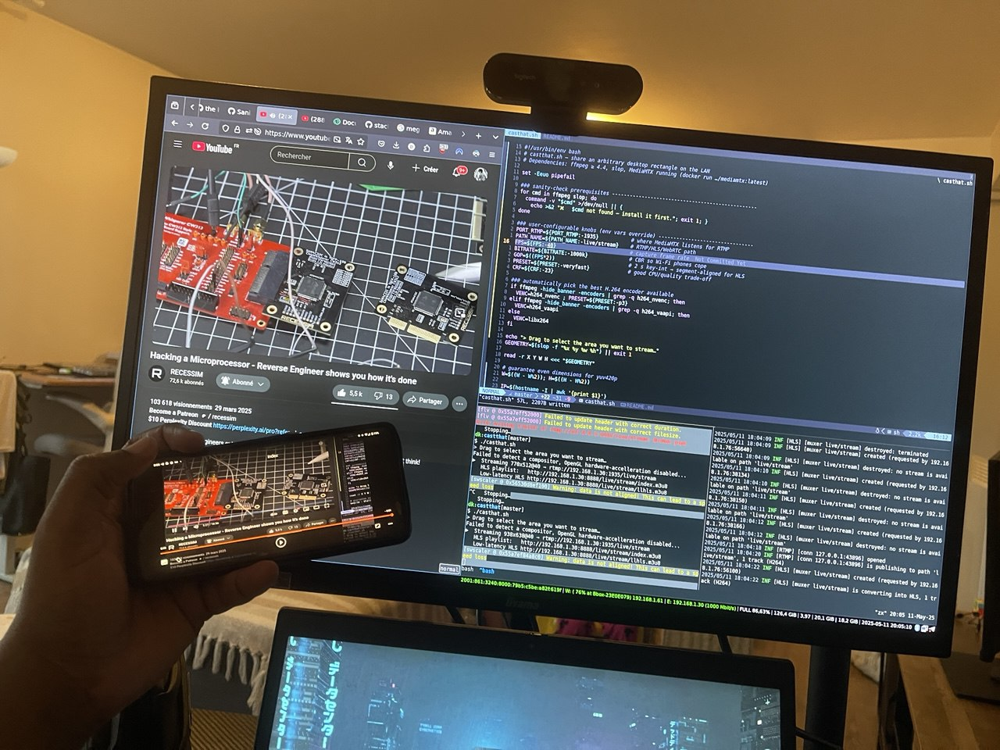

## CASTHAT



A basic script to stream an area of your screen over network accessible via http/tcp/udb (locally or over internet).

## REQUIREMENTS

- Any rtmp/rtsp server (in my case i used the docker mediamtx)
    ```bash
    $ docker run --rm -it --network=host bluenviron/mediamtx:latest
    ```
- ffmpeg
- slop (for the select, drag to extract X, Y, W, H coordinates) for the portion of the screen that will be extract from display by ffmpeg.

## HOW TO RUN

```console
$ ./casthat.sh
> Drag to select the area you want to stream…
Failed to detect a compositor, OpenGL hardware-accelleration disabled... (you can ignore this error)
▶  Streaming 938x638@40 → rtmp://192.168.1.30:1935/live/stream
   HLS playlist:   http://192.168.1.30:8888/live/stream/index.m3u8
   Low-latency HLS http://192.168.1.30:8888/live/stream/llhls.m3u8
```
